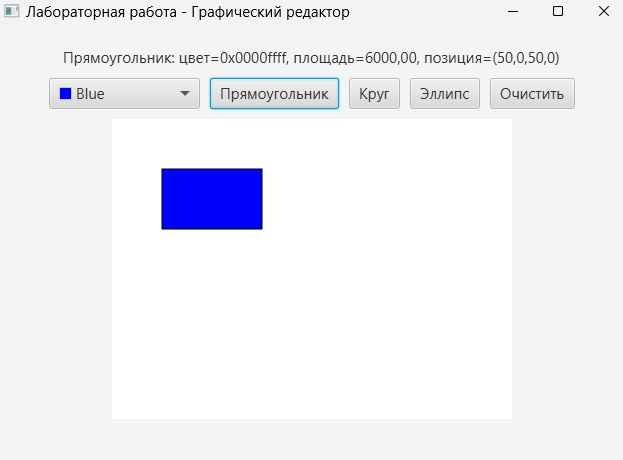
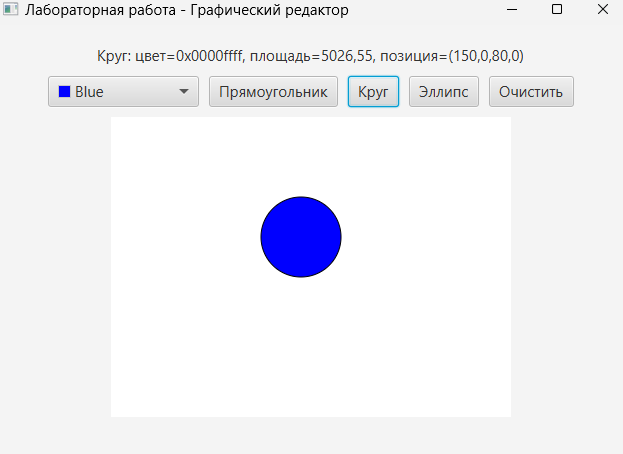
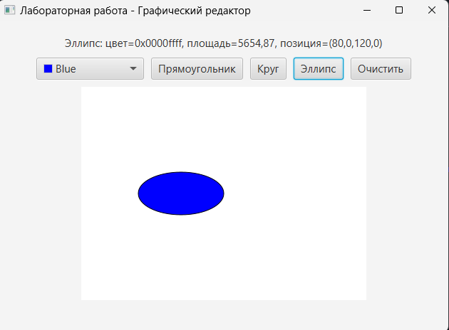

# Лабораторная работа 1 - Графический редактор фигур

> **Dark Edition** | Графический редактор фигур  


Описание: Программа представляет собой систему автоматизированного проектирования для отображения различных геометрических фигур. Реализована иерархия классов фигур с использованием принципов объектно-ориентированного программирования. Проект демонстрирует работу с абстрактными классами, наследованием и полиморфизмом в Java.

Скриншот рабочего окна приложения
##  Архитектура - cкриншоты   

<details>
<summary><b>Скриншоты</b> (Нажми, чтобы развернуть)</summary>

| Скриншот рабочего окна |
| :---: |
|  |

| Скриншот прямоугольника | Скриншот круга |
| :---: | :---: |
|  |  |

| Скриншот элипса |
| :---: |
|  |

</details>

##  Зависимости
  **Для работы программы требуются:**
  1. Java JDK 21 или выше
  2. JavaFX SDK 21.0.2 или выше
  3. IntelliJ IDEA (рекомендуется) или другая Java IDE
  4. Maven для управления зависимостями

##  Установка

1.  **Клонируйте репозиторий:**
    ```bash
    git clone https://github.com/Titan0zxc/JavaRedaktor.git
    ```

2.  **Настройте JavaFX:**
    *   Убедитесь, что JavaFX SDK установлен и путь к нему указан в переменных окружения

3.  **Запустите решение:**
    *   Откройте проект в IntelliJ IDEA
    *   Убедитесь, что в настройках запуска указаны VM options: --module-path "путь/к/javafx-sdk/lib" --add-modules javafx.controls,javafx.fxml
    *   Запустите класс HelloApplication.java 

##  Функциональность

-  Абстрактный суперкласс AbstraktClass - базовый тип для всех фигур
-  Конкретные классы фигур - Rectangle, Circle, Ellipse
-  Графический интерфейс с Canvas для отрисовки
-  Выбор цвета для фигур 
-  Вывод информации о нарисованной фигуре
-  Очистка холста

##  Технологический стек

*   Backend: Java 21, JavaFX 
*   Frontend: JavaFX FXML 
*   Архитектура: MVC (Model-View-Controller)
*   Сборка: Maven
*   Проектирование: Объектно-ориентированное программирование


##  Применение
  1. Запустите приложение
  2. Выберите цвет фигуры с помощью ColorPicker
  3. Нажмите на кнопку с названием фигуры для её отображения
  4. Информация о фигуре отобразится в верхней части окна
  5. Используйте кнопку "Очистить" для очистки холста

##  Проверка ПО
Если программное обеспечение включает автоматизированные тесты, подробно опишите, как запускать эти тесты.

##  Проблемы
  * При первом запуске может потребоваться ручная настройка пути к JavaFX SDK
  * Не реализовано изменение размера фигур в runtime

##  Приглашение к сотрудничеству
  Предложения по развитию проекта:
    * Добавление новых типов фигур (квадрат, треугольник, многоугольник)
    * Реализация перемещения фигур на холсте
    * Добавление возможности изменения размеров фигур
    *Сохранение и загрузка композиций фигур

##  Информация о лицензировании открытого исходного кода
  1. Проект создан в учебных целях
  2. Исходный код доступен для изучения
  3. Разрешено использование в образовательных целях

##  Документация

Полная техническая документация проекта доступна по ссылке:
- [файл.docs](docs/файл.docx)

## Источники и справочники
  1. Oracle JavaFX Documentation
  2. "Объектно-ориентированное программирование в Java" - учебные материалы
  3. JavaFX Tutorials от Oracle

##  Ссылки на другие проекты

*    [Wood Production Management](https://github.com/Titan0zxc/wood-production-management) - Система управления деревообрабатывающим предприятием
*    [University Schedule System](https://github.com/Titan0zxc/university-schedule-system) - Система управления расписанием вуза

---
*Этот проект был разработан в учебных целях.*
